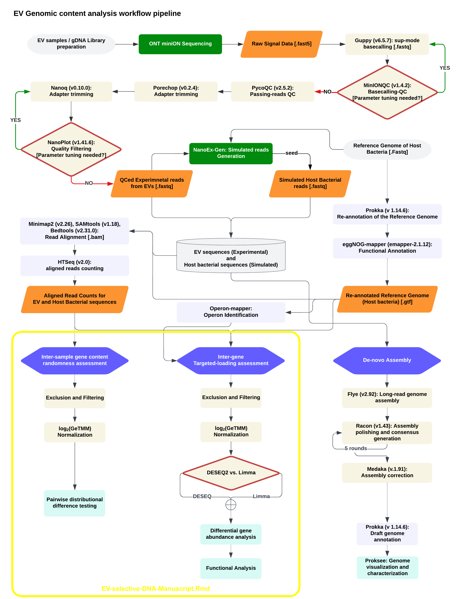

# **EV-selective-DNA-Manuscript**

Scripts and analyses used in the study titled "Analysis of Selective DNA in Extracellular Vesicles". Each folder in this repository contains scripts and data related to specific parts of the analysis. The project is centered around the exploration of genomic data in extracellular vesicles, focusing on COG categories and PFAMs to identify significant patterns and insights.

## **Abstract**

This study provides a comprehensive analysis of selective DNA in extracellular vesicles (EVs), aiming to deepen our understanding of their role in cellular communication and its mechanisms. By employing advanced bioinformatics approaches and genomic data analysis, we identify and characterize key genomic features in EVs compared to its donor bacteria. Our findings reveal distinct patterns in COG categories and PFAMs, offering new insights into the genomic architecture of EVs and their potential implications in various biological significance.

## **Workflow**

This Rmd file is used to answer the highlighted (in yellow) part of the study workflow.
