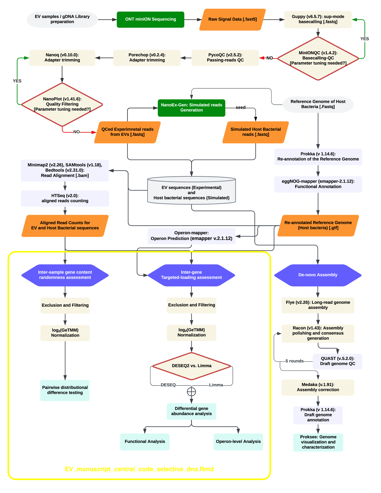

# **EV-selective-DNA-Manuscript**

Each folder in this repository contains scripts and data related to specific parts of the analysis. The project is centered around exploring genomic data in extracellular vesicles, focusing on COG categories, PFAMs and operon-mapping to identify significant patterns and insights.

## **Abstract**

This study provides a comprehensive analysis of selective DNA in extracellular vesicles (EVs), aiming to deepen our understanding of their role in cellular communication and its mechanisms. By employing our bioinformatics approaches and genomic data analysis pipeline, we identify and characterize key genomic features in EVs compared to their parent bacteria.

## **Workflow**

This repository is aimed at serving the highlighted (in yellow) section of the study workflow.
For other sections of the pipeline, please refer to the descriptions below:

## Other sections of the Pipeline
Each component of our study is modularized into separate pipelines, detailed below:

### ONT Long-Reads Simulation
- **NanoEx-Gen**: A tool for simulating Oxford Nanopore Technologies (ONT) long-reads.
  -  [NanoEx-Gen Repository](https://github.com/tedblry/NanoEx-Gen)

### Read Alignment and Counting
- **MappCountFlow**: Designed for precise alignment and counting of sequencing reads.
  -  [MappCountFlow Repository](https://github.com/tedblry/MappCountFlow)

### Genome Assembly and Polishing
- **DeNanoPolish**: A pipeline for assembling and polishing genomic sequences.
  -  [DeNanoPolish Repository](https://github.com/tedblry/DeNanoPolish)

### Contig Alignment and Sorting
- **DenovoContigSort**: A tool for efficient alignment and sorting of genomic contigs.
  -  [DenovoContigSort Repository](https://github.com/tedblry/DenovoContigSort)

## Open Source Commitment
In line with our commitment to open-source principles, all codes and software developed for this research are available on GitHub. We encourage contributions, suggestions, and feedback.
